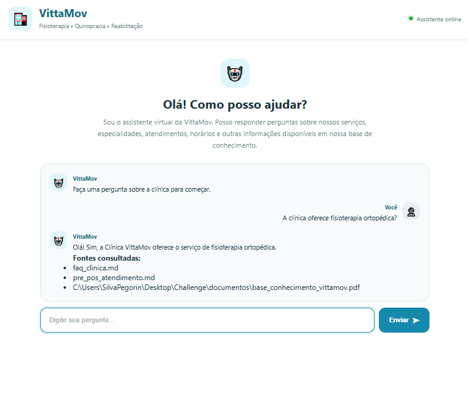
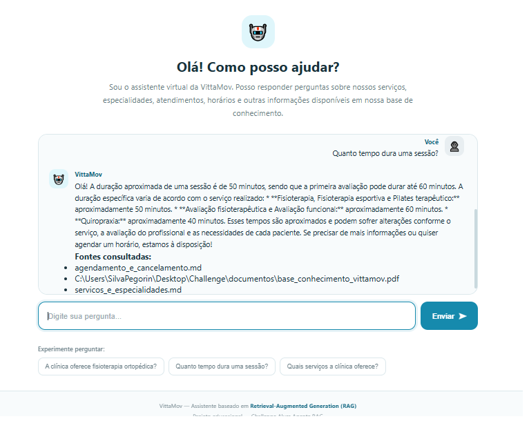
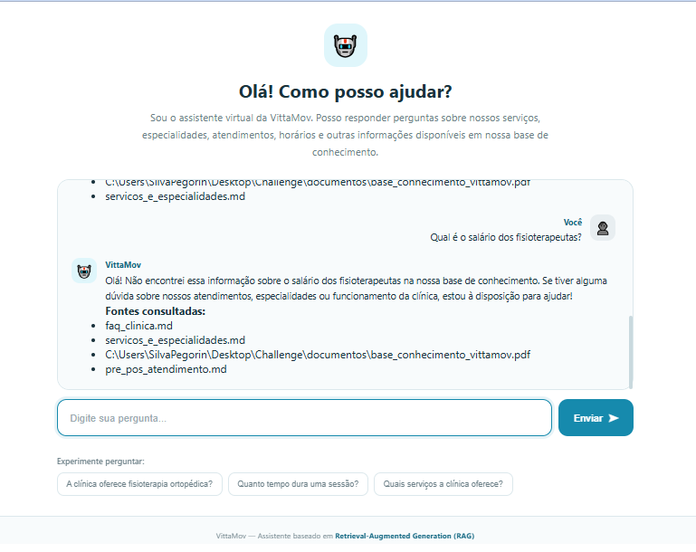
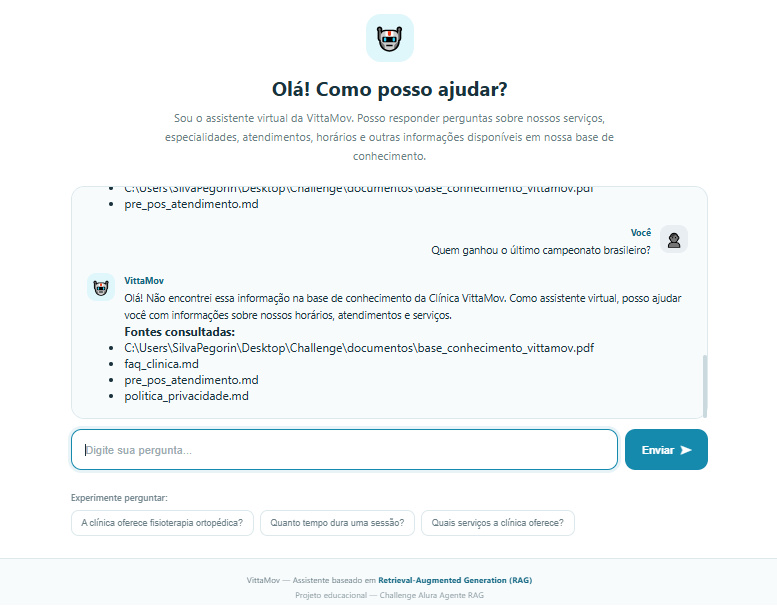

# 🏥 VittaMov — Sistema RAG com Agente de IA

> **Projeto Educacional:** Todas as informações da Clínica VittaMov são fictícias e foram criadas exclusivamente para este projeto do **Challenge Alura Agente RAG**.

Sistema de **Retrieval-Augmented Generation (RAG)** que simula um assistente virtual para a **Clínica VittaMov**, capaz de consultar uma base de conhecimento própria e responder perguntas com base nos documentos recuperados.

---

## 🎯 Objetivo

Construir um assistente virtual de perguntas e respostas baseado em RAG para prestar informações precisas sobre a clínica.

### Fluxo de Funcionamento
```

[Pergunta do usuário]
         ↓
[Busca semântica no ChromaDB]
         ↓
[Recuperação dos documentos relevantes]
         ↓
[Construção do contexto]
         ↓
[Processamento via Google Gemini API]
         ↓
[Resposta fundamentada na base de conhecimento]
```
---

## 🖼️ Visualização do Projeto
Abaixo estão as capturas de tela que mostram a interface do usuário e o funcionamento do assistente.

- **Painel Principal:** A interface do chatbot, limpa e moderna, com sugestões de perguntas rápidas.

- **Consulta à Base:** Exemplo de uma resposta bem fundamentada com as fontes consultadas.

- **Guardrails de Escopo:** O agente identificando perguntas fora do contexto da clínica.

- **Limitação de Conhecimento:** Como o sistema lida com informações não disponíveis na base.

## 🖼️ Demonstração da Interface

| Resposta sobre Serviços | Consulta de Duração |
| :---: | :---: |
|  |  |

| Trata falta de dados | Bloqueio de assuntos fora do escopo |
| :---: | :---: |
|  |  |

---
## 🧠 Tecnologias Utilizadas

- **Linguagem:** Python
- **Orquestração RAG:** LangChain
- **Modelo de Linguagem (LLM):** Google Gemini API
- **Banco Vetorial:** ChromaDB
- **Embeddings:** Sentence Transformers / Hugging Face (Locais)
- **Gerenciamento de Ambientes:** Python-dotenv

---

## 📁 Estrutura do Projeto

```
Challenge/
│
├── chroma_db/                 # Diretório de persistência do ChromaDB
├── chroma/
│   └── db/
├── documentos/
│   └── base_conhecimento/
│       └── vittamov.pdf       # Base de conhecimento em PDF
│
├── src/
│   ├── rag.py                 # Script principal do RAG
│   ├── test_chroma.py         # Diagnóstico do ChromaDB
│   ├── test_modelos.py        # Validação de API Key e modelos
│   └── test_modelo_geracao.py # Testes de modelos de geração
│
├── .env                       # Variáveis de ambiente (não versionado)
├── .gitignore
├── requirements.txt
└── README.md
```
---

## 📚 Base de Conhecimento & RAG

A base de conhecimento da VittaMov cobre tópicos como:

- **Especialidades:** Fisioterapia ortopédica/esportiva, Quiropraxia, Pilates terapêutico, Dores musculoesqueléticas e Reabilitação pós-operatória.
- **Atendimento:** Avaliação funcional, orientações pré/pós-atendimento, horários e duração de sessões.
- **Administrativo:** Agendamentos, cancelamentos, convênios e formas de pagamento.

### Como o RAG Funciona

1. O usuário faz uma pergunta.
2. A pergunta é convertida em um vetor usando **embeddings locais**.
3. É realizada uma busca por similaridade na coleção `vittamov` dentro do **ChromaDB**.
4. Os trechos mais relevantes são resgatados para compor o contexto.
5. O prompt contendo a dúvida + contexto é enviado ao **Gemini**.
6. O modelo gera uma resposta baseada estritamente nas informações encontradas.

---

## 🤖 Comportamento do Agente

O agente foi instruído a seguir diretrizes rígidas:

- Responder **apenas** com base nos dados recuperados.
- **Não inventar** ou alucinar informações.
- Informar com transparência caso um dado não conste na base.
- **Recusar** educadamente perguntas fora do escopo da clínica.

---

## 💬 Exemplos de Funcionamento

**Usuário:** A clínica oferece fisioterapia ortopédica?  
**VittaMov:** Olá! Sim, a Clínica VittaMov oferece o serviço de fisioterapia ortopédica entre as suas especialidades.

---

**Usuário:** Quanto tempo dura uma sessão?  
**VittaMov:** Olá! A duração aproximada de uma sessão varia de acordo com o serviço realizado:
- **Fisioterapia, Fisioterapia esportiva e Pilates terapêutico:** cerca de 50 minutos.
- **Quiropraxia:** cerca de 40 minutos.
- **Avaliação fisioterapêutica e Avaliação funcional:** até 60 minutos.

*Esses tempos são aproximados e podem sofrer alterações conforme avaliação individual.*

---

**Usuário:** Qual é o salário dos fisioterapeutas?  
**VittaMov:** Olá! Eu não encontrei essa informação sobre o salário dos fisioterapeutas na nossa base de conhecimento. Se precisar de ajuda com informações sobre nossos serviços, especialidades ou agendamentos, estou à disposição!

---

**Usuário:** Quem ganhou o último campeonato brasileiro?  
**VittaMov:** Olá! Como assistente virtual da Clínica VittaMov, não encontrei essa informação na minha base de conhecimento. Como essa pergunta está fora do escopo dos serviços da clínica, não consigo ajudá-lo com esse assunto.

---

## 🗄️ Vetorização & Banco de Dados (ChromaDB)

O projeto utiliza o **ChromaDB** para armazenamento e consulta vetorial dos *chunks* de texto.

- **Coleção Principal:** `vittamov` **Volume de Dados:** 109 documentos/vetores indexados.
- *(Nota: A coleção secundária `langchain` foi mantida apenas para histórico de testes e não é consultada pela aplicação em produção).*

---

## 🧪 Testes e Diagnóstico

Scripts auxiliares para validação das etapas do pipeline:

### 1. Verificar modelos disponíveis na sua API Key
```bash
python src/test_modelos.py
```

### 2. Testar resposta dos modelos de geração
```bash
python src/test_modelo_geracao.py
```
### 3. Executar diagnóstico do ChromaDB (coleções e contagem de documentos)
```bash
python src/test_chroma.py
```
---

## ▶️ Como Executar o Projeto

### 1. Clonar o repositório
```bash
git clone https://github.com/SEU-USUARIO/SEU-REPOSITORIO.git
cd Challenge
```
### 2. Criar e ativar o ambiente virtual

# Criar venv
```bash
python -m venv .venv
```
# Ativar no Windows (PowerShell)
```bash
.venv\Scripts\Activate.ps1
```
# Ativar no Linux/Mac
```bash
source .venv/bin/activate
```
### 3. Instalar dependências
```bash
pip install -r requirements.txt
```
### 4. Configurar variáveis de ambiente
Crie um arquivo `.env` na raiz do projeto contendo sua chave da Google Gemini API:
```bash
GOOGLE_API_KEY=sua_api_key_aqui
```
### 5. Executar a aplicação
```bash
python src/rag.py
```
---

## 📊 Status do Projeto e Resultados

- [x] Base de conhecimento estruturada e processada
- [x] Embeddings locais gerados com sucesso
- [x] ChromaDB configurado com busca por similaridade
- [x] Integração completa com a API do Google Gemini
- [x] Guardrails de escopo e alucinação validados em testes
- [x] Rastreabilidade de fontes/documentos recuperados
- [x] Interface gráfica de usuário.

---

## 🚀 Possíveis Evoluções

- [ ] Memória conversacional de múltiplos turnos.
- [ ] Métrica de avaliação de RAG (Ragas / TruLens).
- [ ] Re-ranking de documentos para otimizar o contexto.
- [ ] API REST (FastAPI) para integração com canais (WhatsApp/Web).

---

## 💻 Autor

**Kleber Rafael**    
*Analista Fiscal Tech | Analista de Sistemas | Inteligência Tributária com Dados e IA*  

Profissional focado em soluções inteligentes combinando tecnologia, desenvolvimento e Inteligência Artificial.

---

*Este repositório foi desenvolvido para fins estritamente educacionais no contexto do Challenge Alura Agente RAG.*
